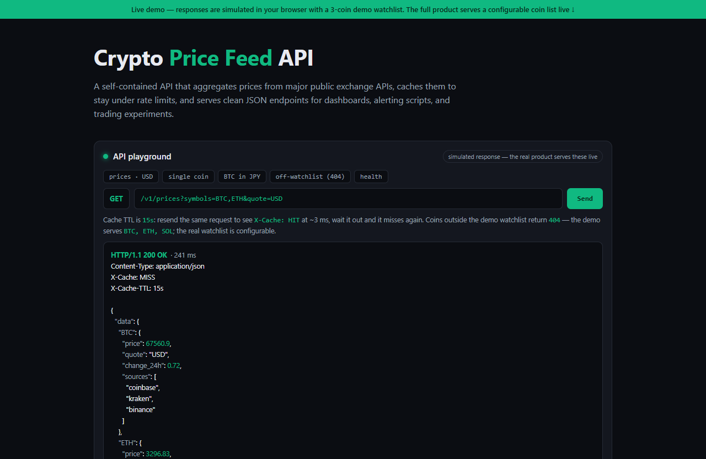

# Crypto Price Feed API — live demo

  

  <a href="https://amos-mig.github.io/crypto-price-feed-api-demo/"><strong>▶ Open the live demo</strong></a> ·
  <a href="https://amosmign.gumroad.com/l/crypto-price-feed-api"><strong>Get the full product · €29</strong></a>

## What this is

A browser-based simulation of the Crypto Price Feed API: send GET requests to /v1/prices, /v1/price/{symbol} and /v1/health and get realistic JSON responses with status codes, latency and X-Cache MISS/HIT headers that react to your input. The demo watchlist is limited to BTC, ETH and SOL — quote-currency conversion, 404 handling and cache behaviour all work, while streaming and alerting stay locked.

**Try it:** Hit Send twice on the same request and watch X-Cache flip from MISS (~150 ms) to HIT (~3 ms), then try /v1/prices?symbols=DOGE to see the 404.

## What you get in the full product

- Aggregates prices from major public exchange APIs
- Built-in caching to stay under rate limits
- Clean JSON endpoints ready for dashboards and bots
- Configurable watchlist of coins and quote currencies
- Single Python file — deploy on a cheap VPS or free tier

## About

- **Storefront:** [kits.amosmignery.dev](https://kits.amosmignery.dev) — single-file products, instant download, commercial license
- **Checkout:** [Gumroad](https://amosmign.gumroad.com/l/crypto-price-feed-api) (Merchant of Record, VAT handled)
- **Full product:** [Crypto Price Feed API](https://amosmign.gumroad.com/l/crypto-price-feed-api) · €29

## License

The demo page in this repo is MIT-licensed — reuse the technique, not the product.
The **Crypto Price Feed API** itself is not included here and is not free software.
